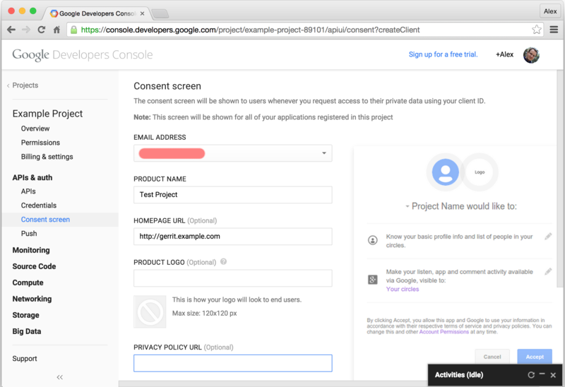
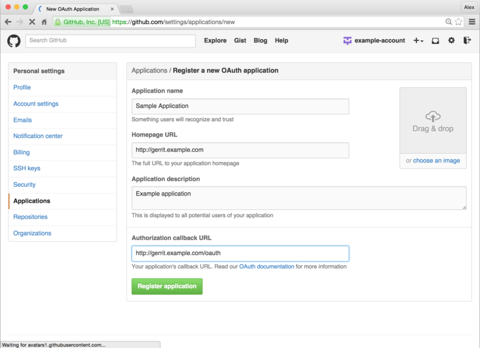
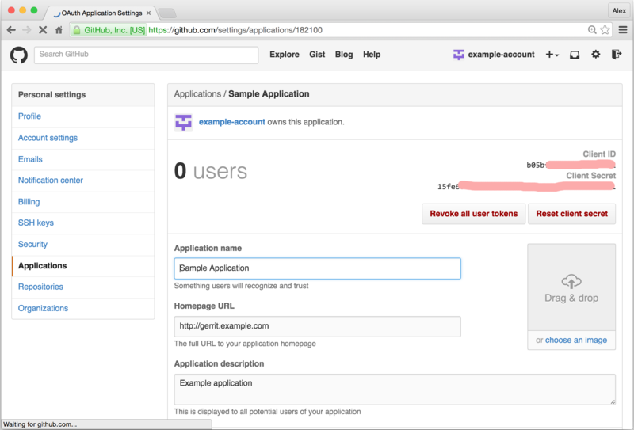
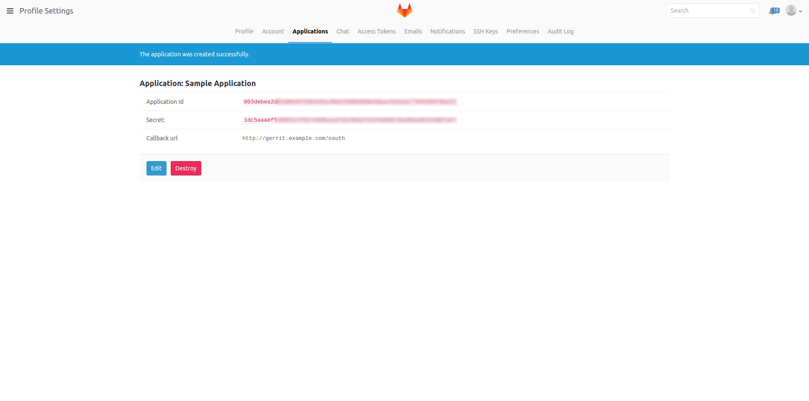

Configuration
=============

The configuration of the @PLUGIN@ plugin is done in the `gerrit.config`
file. `auth.type` must be set to `OAUTH`:

```
[auth]
  type = OAUTH
```

Providers are configured under @PLUGIN@ section,
appended with provider suffix: e.g. `-google-oauth` or `-github-oauth`:

```
  [plugin "@PLUGIN@-google-oauth"]
    client-id = "<client-id>"
    client-secret = "<client-secret>"
    link-to-existing-openid-accounts = true

  [plugin "@PLUGIN@-github-oauth"]
    root-url = "<github url>" # https://github.com/ or https://git.company.com/
    client-id = "<client-id>"
    client-secret = "<client-secret>"

  [plugin "@PLUGIN@-cas-oauth"]
    root-url = "<cas url>"
    client-id = "<client-id>"
    client-secret = "<client-secret>"
    use-json-extractor = false

  [plugin "@PLUGIN@-gitlab-oauth"]
    root-url = "<gitlab url>"
    client-id = "<client-id>"
    client-secret = "<client-secret>"

  [plugin "@PLUGIN@-dex-oauth"]
    domain = "<domain for username manipulation (optional)>"
    service-name = "<custom service name (optional)>"
    root-url = "<dex url>"
    client-id = "<client-id>"
    client-secret = "<client-secret>"

  [plugin "@PLUGIN@-airvantage-oauth"]
    client-id = "<client-id>"
    client-secret = "<client-secret>"

  [plugin "@PLUGIN@-phabricator-oauth"]
    client-id = "<client-id>"
    client-secret = "<client-secret>"
    root-url = "<phabricator url>"

  # The office365 has been renamed to azure and is deprecated.
  [plugin "@PLUGIN@-office365-oauth"]
    client-id = "<client-id>"
    client-secret = "<client-secret>"
    tenant = "<tenant (optional defaults to organizations if not set)>"

  [plugin "@PLUGIN@-azure-oauth"]
    client-id = "<client-id>"
    client-secret = "<client-secret>"
    tenant = "<tenant (optional defaults to organizations if not set)>"
    link-to-existing-office365-accounts = true #Optional, if set will try to link old account with the @PLUGIN@-office365-oauth naming

  [plugin "@PLUGIN@-keycloak-oauth"]
    # Prior to Keycloak V17 /auth path must be added to the root-url, see this migration instruction:
    # https://www.keycloak.org/migration/migrating-to-quarkus
    root-url = "<root url>" # for example, https://signon.example.com, or https://signon.example.com/auth
    realm = "<realm>"
    client-id = "<client-id>"
    client-secret = "<client-secret>"
    use-preferred-username = true # Optional, if false will not send preferred_username from Keycloak to leave username unset
    link-to-existing-gerrit-accounts = false

  [plugin "@PLUGIN@-tuleap-oauth"]
    service-name = "<custom service name (optional)>"
    root-url = "<root url>" # for example, https://tuleap.example.com
    client-id = "<client-id>"
    client-secret = "<client-secret>"

  [plugin "@PLUGIN@-auth0-oauth"]
    root-url = "<root url>" # for example, https://dev-abc.us.auth0.com
    client-id = "<client-id>"
    client-secret = "<client-secret>"

  [plugin "@PLUGIN@-authentik-oauth"]
    root-url = "<root url>" # for example, https://authentik.example.com
    client-id = "<client-id>"
    client-secret = "<client-secret>"
    link-to-existing-gerrit-accounts = false

  [plugin "@PLUGIN@-cognito-oauth"]
    root-url = "<root url>" # for example, https://cognito.example.com
    client-id = "<client-id>"
    client-secret = "<client-secret>"
```

When one from the sections above is omitted, OAuth SSO is used.
The login form with provider selection isn’t shown. When all
sections are omitted, Gerrit will not start.

Google OAuth provider seamlessly supports linking of OAuth identity
to existing OpenID accounts. This feature is deactivated by default.
To activate it, add

```
plugin.gerrit-oauth-provider-google-oauth.link-to-existing-openid-accounts = true
```

to Google OAuth configuration section.

It is possile to restrict sign-in to accounts of one or more (hosted) domains for
Google OAuth. Multiple `domain` options can be added:

```
plugin.gerrit-oauth-provider-google-oauth.domain = "mycollege.edu"
plugin.gerrit-oauth-provider-google-oauth.domain = "myschool.net"
```

(See the spec)[https://developers.google.com/identity/protocols/OpenIDConnect#hd-param]
for more information. To protect against client-side request modification, the returned
ID token is checked to contain a matching hd claim (which is proof the account does belong
to the hosted domain). If the hd claim wasn't included in ID token or didn't match the
provided `domain` configuration option the authentication is rejected. Note: Because of
current limitation of the OAuth extension point in gerrit (blame /me for that) the user
would only see "Unauthorized" message.

By default the Google OAuth provider will not set a username (used for ssh) and
the user can choose one from the web ui (needed before using ssh). It is possible
to automatically use the user part from the google apps email. This is deactivated
by default. To activate it, add:

```
plugin.gerrit-oauth-provider-google-oauth.use-email-as-username = true
```

Note: the usernames are unique in gerrit. If a username already exists this will
be ignored and the user will have to choose a different one from the web ui.

### CAS OAuth

For CAS OAuth setting

```
plugin.gerrit-oauth-provider-cas-oauth.root-url = "https://example.com/cas"
```

is required, since CAS is a self-hosted application.

Note that the CAS OAuth plugin only supports CAS V5 and higher. Both plain text
and JSON responses are supported (see configuration).

The plugin expects CAS to make several attributes available to it:

| Name | Description | Required |
|---|---|---|
| id | External ID | yes |
| login | Login name | no |
| email |  Email address | no |
| name | Display name | no |

### CoreOS Dex OAuth

For Dex OAuth setting

```
plugin.gerrit-oauth-provider-dex-oauth.root-url = "https://example.com"
```

is required, since Dex is a self-hosted application.

## Obtaining provider authorizations

### Google

To obtain client-id and client-secret for Google OAuth, go to
[Google Developers Console](https://console.developers.google.com):

- Create a project

  

- Go inside the created project

- In "APIs & auth"/"Credentials" select "Create new Client ID" and
create Client ID for a Web application

  

- Enter additional information about the project, which will be
  presented to user during the authentication process

  

- Specify authorized redirect URL: `<canonical-web-uri-of-gerrit>/oauth`

  

After the final step, the page will show generated client id and
secret.


### GitHub

To obtain client-id and client-secret for GitHub OAuth, go to
[Applications settings in your GitHub account](https://github.com/settings/applications):

- Select "Register new application" and enter information about the
  application.

  Note that it is important that authorization callback URL points to
  `<canonical-web-uri-of-gerrit>/oauth`.

  


After application is registered, the page will show generated client id and
secret.



### CAS

The client-id and client-secret for CAS OAuth are part of the CAS
service definition and need to be set manually.

See
[the CAS documentation](https://apereo.github.io/cas/4.2.x/installation/OAuth-OpenId-Authentication.html#add-oauth-clients)
for an example.

### GitLab

To obtain client-id and client-secret for GitLab OAuth, go to
Applications settings in your GitLab profile:

- Select "Save application" and enter information about the
  application.

  Note that it is important that Redirect URI points to
    `<canonical-web-uri-of-gerrit>/oauth`.

  


After application is saved, the page will show generated client id and
secret.



### CoreOS Dex

The client-id and client-secret for Dex OAuth are part of the Dex
setup and need to be set manually.

See
[Using Dex](https://github.com/coreos/dex/blob/master/Documentation/using-dex.md)
for an example.

### AirVantage

The client-id and client-secret for AirVantage OAuth can be obtained by registering
a Client application.
See [Getting Started](https://source.sierrawireless.com/airvantage/av/howto/cloud/gettingstarted_api).

### Phabricator

The client-id and client-secret for Phabricator can be obtained by registering a
Client application.
See [Using the Phabricator OAuth Server](https://secure.phabricator.com/book/phabcontrib/article/using_oauthserver/).

### Tuleap

The client-id and client-secret for Tuleap can be obtained by registering a
Client application.
See [Registering a new application](https://docs.tuleap.org/user-guide/oauth2.html#client-registration).

### Azure (previously named Office365)
Were previously named Office365 but both `plugin.gerrit-oauth-provider-azure-oauth` and
`plugin.gerrit-oauth-provider-office365-oauth` is supported by the Azure OAuth.
When running *java gerrit.war init* it will check the existing config to see if it finds the old
naming and use that during the init run, if it does not find the `office365-oauth` it will
use the new `azure-oauth` naming.

The client-id and client-secret for Azure can be obtained by registering a new application,
see [OAuth 2.0 and OpenID Connect protocols on Microsoft identity platform](https://docs.microsoft.com/en-us/azure/active-directory/develop/active-directory-v2-protocols).

####Username
By default, Azure OAuth will not set a username (used for ssh) and the user can choose one from the web ui
can be used.
```
plugin.gerrit-oauth-provider-azure-oauth.use-email-as-username = true
```

####Tenant
The Azure OAuth is default set to use the tenant `organizations` but a specific tenant can be used by
the option `tenant`. If a tenant other than `common`, `organizations` or `consumers` is used then the tokens will be
validated that they are originating from the same tenant that is configured in the Gerrit OAuth plugin.
See [Microsoft identity platform and OpenID Connect protocol](https://docs.microsoft.com/en-us/azure/active-directory/develop/v2-protocols-oidc#fetch-the-openid-connect-metadata-document)
```
plugin.gerrit-oauth-provider-azure-oauth.tenant = <tenant to use>
```

Regardless of tenant all tokens will be checked that they contain the client_id set
in the Azure OAuth.

####Migrating from Office365 naming
If this where previously installed with the `office365-oauth` you can migrate to `azure-oauth` by setting the
flag.
```
plugin.gerrit-oauth-provider-azure-oauth.link-to-existing-office365-accounts = true
```
This will try to link the old `office365-oauth` external id to the new `azure-oauth` external id automatically.
Another option is to migrate these manually offline, see [External IDs](https://gerrit-review.googlesource.com/Documentation/config-accounts.html#external-ids)
for more information.

### Keycloak

When setting up a client in Keycloak for Gerrit, enter a value for the *Client ID* and ensure you choose the `openid-connect`
protocol and select the `confidential` access type. Once you click save, a *Credentials* tab will appear where you will find
the Secret.

The root URL will the protocol and hostname of your Keycloak instance (for example, https://signon.example.com).

You can optionally set `link-to-existing-gerrit-accounts = true` if you want the provider to link a account based
on the username instead of trying to create a new account, see below migration from LDAP.

You can optionally set `use-preferred-username = false` if you would prefer to not have the `preferred_username`
token be automatically set as the users username, and instead let users choose their own usernames.
If you use the `link-to-existing-gerrit-accounts = true` setting, you also need to use the `use-preferred-username = true` setting.

### Authentik

When setting up a Application in Authentik for Gerrit use the `OAuth2/OpenID Provider` type.

You can optionally set `link-to-existing-gerrit-accounts = true` if you want the provider to link a account based
on the username instead of trying to create a new account, see below migration from LDAP.

### Cognito

The client-id and secret-id can be obtained in the AWS Cognito web interface once you create a new App Integration for Gerrit.
See [Creating an app integration](https://docs.aws.amazon.com/cognito/latest/developerguide/cognito-user-pools-configuring-app-integration.html).

#### Migrating from LDAP

Set the `link-to-existing-gerrit-accounts = true` option.

If you have used LDAP before and have accounts with an externalIDs like `gerrit:firstname.lastname` and a user in Authentik
with username `firstname.lastname` logs in it will link the Authentik account to that Gerrit account.

When all users has logged in once in Gerrit with their Authentik account it's recommended that the configuration option is removed.
