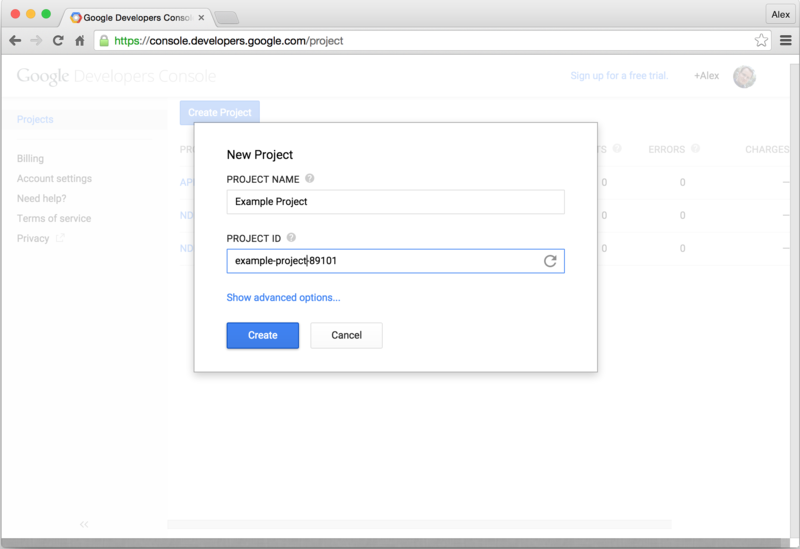
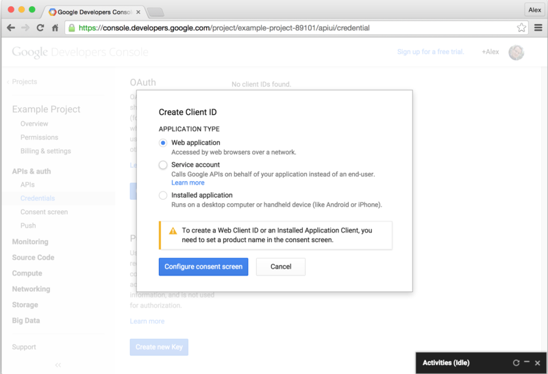
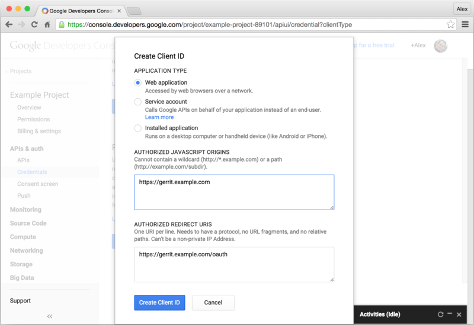
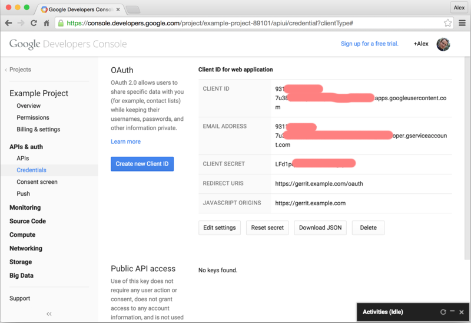
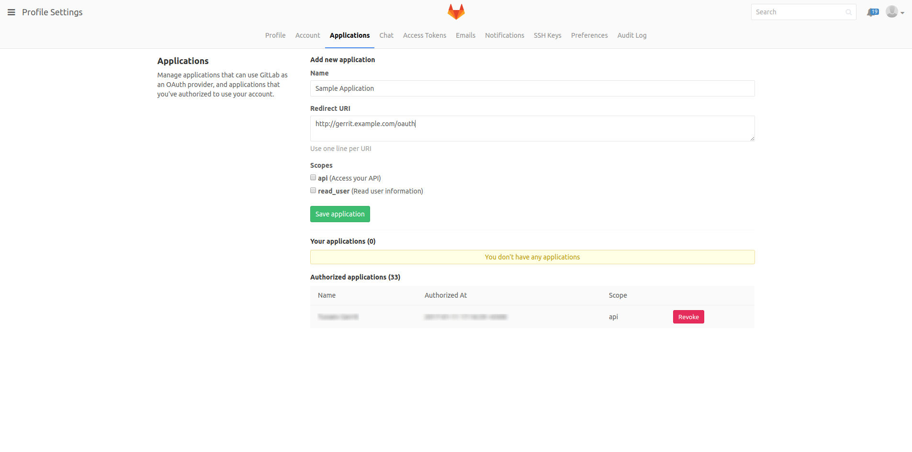

Configuration
=============

The configuration of the @PLUGIN@ plugin is done in the `gerrit.config`
file. `auth.type` must be set to `OAUTH`:

```
[auth]
  type = OAUTH
```

Providers are configured under @PLUGIN@ section,
appended with provider suffix: e.g. `-google-oauth` or `-github-oauth`:

```
  [plugin "@PLUGIN@-google-oauth"]
    client-id = "<client-id>"
    client-secret = "<client-secret>"
    link-to-existing-openid-accounts = true

  [plugin "@PLUGIN@-github-oauth"]
    root-url = "<github url>" # https://github.com/ or https://git.company.com/
    client-id = "<client-id>"
    client-secret = "<client-secret>"

  [plugin "@PLUGIN@-cas-oauth"]
    root-url = "<cas url>"
    client-id = "<client-id>"
    client-secret = "<client-secret>"

  [plugin "@PLUGIN@-gitlab-oauth"]
    root-url = "<gitlab url>"
    client-id = "<client-id>"
    client-secret = "<client-secret>"

  [plugin "@PLUGIN@-dex-oauth"]
    domain = "<domain for username manipulation (optional)>"
    service-name = "<custom service name (optional)>"
    root-url = "<dex url>"
    client-id = "<client-id>"
    client-secret = "<client-secret>"

  [plugin "@PLUGIN@-airvantage-oauth"]
    client-id = "<client-id>"
    client-secret = "<client-secret>"

  [plugin "@PLUGIN@-phabricator-oauth"]
    client-id = "<client-id>"
    client-secret = "<client-secret>"
    root-url = "<phabricator url>"

  [plugin "@PLUGIN@-office365-oauth"]
    client-id = "<client-id>"
    client-secret = "<client-secret>"
    tenant = "<tenant (optional defaults to organizations if not set)>"
```

When one from the sections above is omitted, OAuth SSO is used.
The login form with provider selection isn’t shown. When all
sections are omitted, Gerrit will not start.

Google OAuth provider seamlessly supports linking of OAuth identity
to existing OpenID accounts. This feature is deactivated by default.
To activate it, add

```
plugin.gerrit-oauth-provider-google-oauth.link-to-existing-openid-accounts = true
```

to Google OAuth configuration section.

It is possile to restrict sign-in to accounts of one or more (hosted) domains for
Google OAuth. Multiple `domain` options can be added:

```
plugin.gerrit-oauth-provider-google-oauth.domain = "mycollege.edu"
plugin.gerrit-oauth-provider-google-oauth.domain = "myschool.net"
```

(See the spec)[https://developers.google.com/identity/protocols/OpenIDConnect#hd-param]
for more information. To protect against client-side request modification, the returned
ID token is checked to contain a matching hd claim (which is proof the account does belong
to the hosted domain). If the hd claim wasn't included in ID token or didn't match the
provided `domain` configuration option the authentication is rejected. Note: Because of
current limitation of the OAuth extension point in gerrit (blame /me for that) the user
would only see "Unauthorized" message.

By default the Google OAuth provider will not set a username (used for ssh) and
the user can choose one from the web ui (needed before using ssh). It is possible
to automatically use the user part from the google apps email. This is deactivated
by default. To activate it, add:

```
plugin.gerrit-oauth-provider-google-oauth.use-email-as-username = true
```

Note: the usernames are unique in gerrit. If a username already exists this will
be ignored and the user will have to choose a different one from the web ui.

### CAS OAuth

For CAS OAuth setting

```
plugin.gerrit-oauth-provider-cas-oauth.root-url = "https://example.com/cas"
```

is required, since CAS is a self-hosted application.

Note that the CAS OAuth plugin only supports CAS V5 and higher.

The plugin expects CAS to make several attributes available to it:

| Name | Description | Required |
|---|---|---|
| id | External ID | yes |
| login | Login name | no |
| email |  Email address | no |
| name | Display name | no |

### CoreOS Dex OAuth

For Dex OAuth setting

```
plugin.gerrit-oauth-provider-dex-oauth.root-url = "https://example.com"
```

is required, since Dex is a self-hosted application.

## Obtaining provider authorizations

### Google

To obtain client-id and client-secret for Google OAuth, go to
[Google Developers Console](https://console.developers.google.com):

- Create a project

  

- Go inside the created project

- In "APIs & auth"/"Credentials" select "Create new Client ID" and
create Client ID for a Web application

  

- Enter additional information about the project, which will be
  presented to user during the authentication process

  

- Specify authorized redirect URL: `<canonical-web-uri-of-gerrit>/oauth`

  

After the final step, the page will show generated client id and
secret.



### GitHub

To obtain client-id and client-secret for GitHub OAuth, go to
[Applications settings in your GitHub account](https://github.com/settings/applications):

- Select "Register new application" and enter information about the
  application.

  Note that it is important that authorization callback URL points to
  `<canonical-web-uri-of-gerrit>/oauth`.

  


After application is registered, the page will show generated client id and
secret.


### CAS

The client-id and client-secret for CAS OAuth are part of the CAS
service definition and need to be set manually.

See
[the CAS documentation](https://apereo.github.io/cas/4.2.x/installation/OAuth-OpenId-Authentication.html#add-oauth-clients)
for an example.

### GitLab

To obtain client-id and client-secret for GitLab OAuth, go to
Applications settings in your GitLab profile:

- Select "Save application" and enter information about the
  application.

  Note that it is important that Redirect URI points to
    `<canonical-web-uri-of-gerrit>/oauth`.

  


After application is saved, the page will show generated client id and
secret.


### CoreOS Dex

The client-id and client-secret for Dex OAuth are part of the Dex
setup and need to be set manually.

See
[Using Dex](https://github.com/coreos/dex/blob/master/Documentation/using-dex.md)
for an example.

### AirVantage

The client-id and client-secret for AirVantage OAuth can be obtained by registering
a Client application.
See [Getting Started](https://source.sierrawireless.com/airvantage/av/howto/cloud/gettingstarted_api).

### Phabricator

The client-id and client-secret for Phabricator can be obtained by registering a
Client application.
See [Using the Phabricator OAuth Server](https://secure.phabricator.com/book/phabcontrib/article/using_oauthserver/).

### Office365
The client-id and client-secret for Office365/Azure can be obtained by registering a new application,
see [OAuth 2.0 and OpenID Connect protocols on Microsoft identity platform](https://docs.microsoft.com/en-us/azure/active-directory/develop/active-directory-v2-protocols).

####Username
By default Office365 OAuth will not set a username (used for ssh) and the user can choose one from the web ui
(needed before using ssh). To automatically set the user part from the email the option *use-email-as-username*
can be used.
```
plugin.gerrit-oauth-provider-office365-oauth.use-email-as-username = true
```

####Tenant
By default, the Gerrit OAuth plugin is using the tenant `organizations`. A specific tenant can be set
by using the option `tenant`.
```
plugin.gerrit-oauth-provider-office365-oauth.tenant = <tenant to use>
```

If a specific tenant is set Gerrit OAuth plugin will inspect the token and validate that this is
originating from the Azure AD with the tenant specified in the option.

By default, all tokens will be checked that they contain the client_id set 
in the Gerrit OAuth plugin. 
>>>>>>> 3f04c93 (Validate the tokens issued from Azure)
